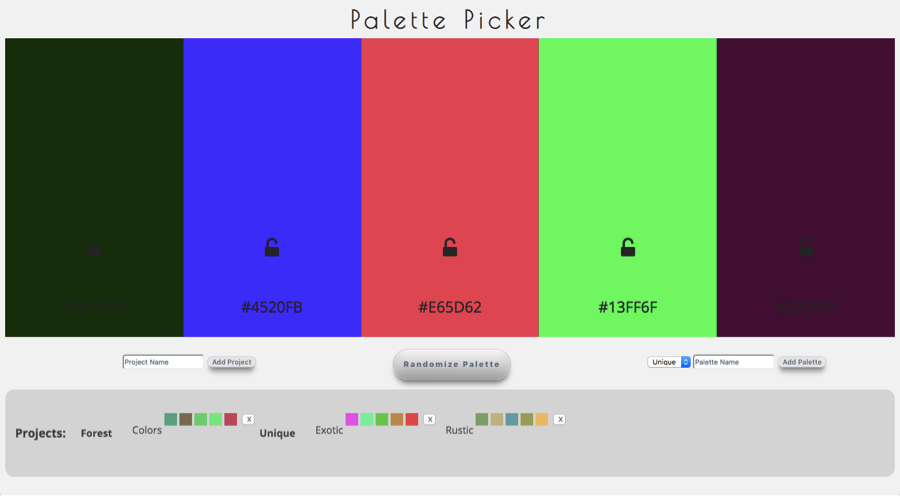

# Palette-Picker

Palette-Picker is an application that allows the user to generate five random colors, lock certain colors of their choice, and save their
favorite palettes to projects. This application was built with jQuery on the frontend and an Express backend.

Design inspiration from Dribbble used in this project: https://dribbble.com/shots/4667460-S-M-O-O-T-H

